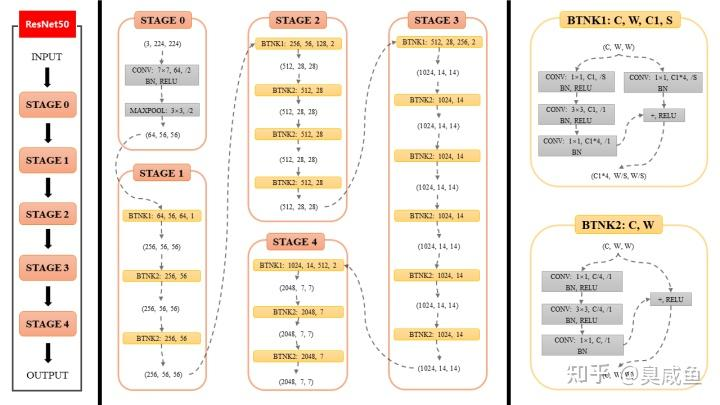
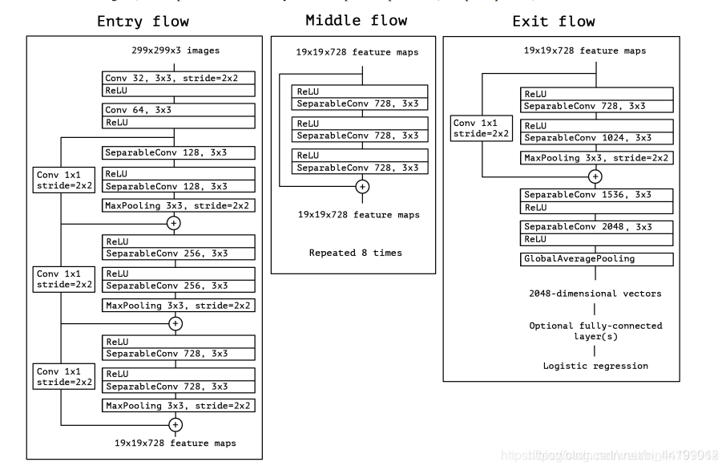

# BackBone

## Paper

| Model                                  | Link                                 |
| -------------------------------------- | ------------------------------------ |
| <a href="#ResNet">ResNet</a>           | <https://arxiv.org/abs/1512.03385v1> |
| <a href="#ResNext">ResNext</a>         | <https://arxiv.org/abs/1611.05431>   |
| <a href="#MobileNetV2">MobileNetV2</a> | <http://arxiv.org/abs/1801.04381>    |
| <a href="#MobileNetV3">MobileNetV3</a> | <http://arxiv.org/abs/1905.02244>    |
| <a href="#Xception">Xception</a>       | <http://arxiv.org/abs/1610.02357>    |

## Architecture

### ResNet

### ResNext

### MobileNetV2

### MobileNetV3

### Xception

