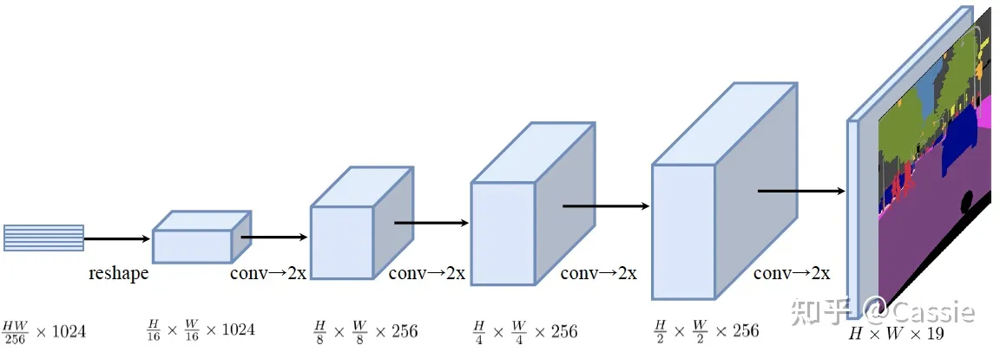
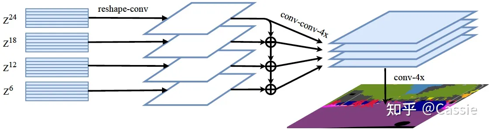

# Transformer

## Paper

| Model                    | Link                               |
| ------------------------ | ---------------------------------- |
| <a href="#ViT">ViT</a>   | <http://arxiv.org/abs/2010.11929>  |
| <a href="#SETR">SETR</a> | <https://arxiv.org/abs/2012.15840> |

## Architecture

### ViT

### SETR

#### PUP (Progressive UPsampling)

#### MLA (Multi-Level feature Aggregation)

