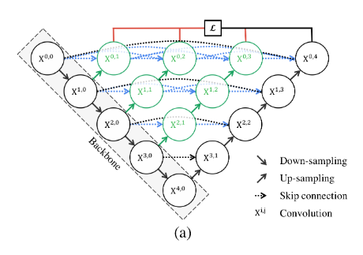

# U-Net

## Paper

| Model                                  | Link                                           |
| -------------------------------------- | ---------------------------------------------- |
| Attention UNet                         | <https://arxiv.org/abs/1804.03999>             |
| Attention UNet++                       | <https://ieeexplore.ieee.org/document/9190761> |
| <a href="#Double UNet">Double UNet</a> | <http://arxiv.org/abs/2006.04868>              |
| <a href="#UNet">UNet</a>               | <http://arxiv.org/abs/1505.04597>              |
| <a href="#UNet++">UNet++</a>           | <http://arxiv.org/abs/1807.10165>              |
| <a href="#UNet+++">UNet++</a>          | <https://arxiv.org/abs/2004.08790>             |
| <a href="#U2Net">U2Net</a>             | <https://arxiv.org/abs/2005.09007>             |

## Architecture

### Attention UNet

### Attention UNet++

### Double UNet

### UNet

### UNet++

### UNet+++

### U2Net

