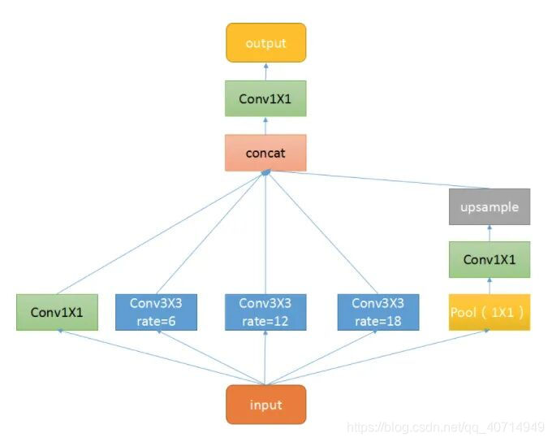

# Core

## Modules

### ASPP_v3

- 一个 1×1 的卷积对 input 进行降维
- 一个 padding 为 6，dilation 为 6，核大小为 3×3 的卷积层进行卷积
- 一个 padding 为 12，dilation 为 12，核大小为 3×3 的卷积层进行卷积
- 一个 padding 为 18，dilation 为 18，核大小为 3×3 的卷积层进行卷积
- 一个尺寸为 input 大小的池化层将 input 池化为 1×1，再用一个 1×1 的卷积进行降维，最后上采样回原始输入大小

